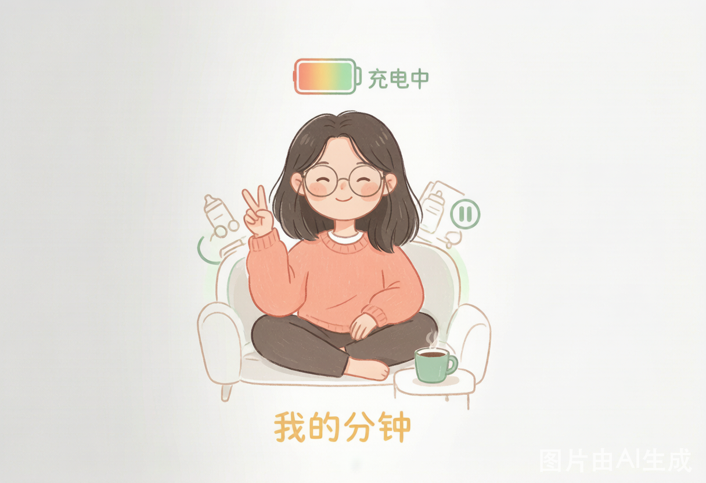
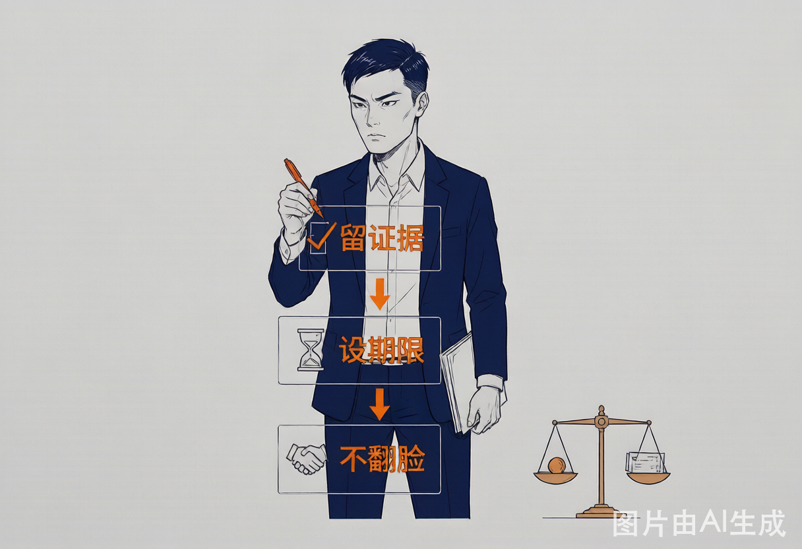

# 個人 IP 視覺分身

[English](README.md) | [简体中文](README.zh-CN.md) | [繁體中文](README.zh-TW.md)

這是一個 Codex skill，用於把創作者本人或虛擬人設沉澱成可重複使用的個人 IP 視覺分身，並生成穩定一致的中文視覺內容：正文配圖、封面圖、知識卡片、工作流圖和多角色畫面。

這個專案不是一組一次性繪圖 prompt，而是一個面向 Codex 的小型角色資產系統：每個視覺分身都有結構化角色卡、穩定的 `character_lock`、標準參考圖、配色規則、表情錨點和 workspace 級輸出庫。

## 為什麼做這個

AI 圖像生成很擅長畫出一張好看的圖，但不擅長在很多主題裡持續保持同一個角色。對寫作者、教育者、創作者、顧問、產品人和技術部落客來說，視覺一致性很重要：同一個角色應該在不同文章和社群內容裡保持相同的臉、氣質、服裝、配色、道具和標註風格。

個人 IP 視覺分身的目標，就是把一個人的身分、氣質和風格整理成一個可重複使用的 IP 物件。

你不再只是說：

```text
幫我為這篇文章畫一張圖。
```

而是可以說：

```text
Use $personal-ip-illustrations 用我已有的 IP，為這篇草稿生成 4 張正文配圖。
```

skill 會解析 IP Card，注入完整 `character_lock`，選擇表情狀態，套用配色系統，規劃視覺隱喻，並把輸出保存在該 IP 自己的資料夾中。

## 功能

- 從一句簡短描述建立結構化個人 IP Card。
- 從照片的寬泛特徵建立卡通視覺分身，同時避免保存生物識別資訊。
- 為新 IP 生成 4 張標準參考圖。
- 生成穩定一致的正文配圖。
- 為長文章規劃配圖 shot list。
- 生成社群封面、主視覺和知識卡片。
- 支援單 IP 和明確要求時的多 IP 同場景畫面。
- 使用 `character_lock` 保持角色身分一致。
- 支援 `line-art` 和 `colored` 兩種渲染模式。
- 使用 `palette_preset` 和每個 IP 自己的三元配色。
- 將 prompt、manifest 和輸出保存在 `ip-library/`。

## 適合誰

- 想擁有穩定視覺分身的寫作者。
- 需要乾淨概念配圖的技術部落客和開發者。
- 需要溫暖持續角色的教育、育兒、心理諮詢類創作者。
- 需要解釋框架或工作流的顧問、產品人和知識工作者。
- 想把個人 IP 做成可重複使用資產，而不是每次重新畫圖的內容創作者。
- 想用 Codex 做可重複使用視覺內容工作流的人。

## 核心概念

### IP Card

IP Card 是一個結構化 YAML 物件，用來描述一個可重複使用個人角色。它包含身分、氣質、外形錨點、服裝、道具、常見動作、內容領域、配色、渲染模式、表情錨點、禁用風格和示例主題。

### Character Lock

`character_lock` 是每次生成圖片時注入 prompt 的不可變角色鎖定塊，用來保持角色身分一致。它描述的是生成後的卡通 IP，不是真人的臉。注入時應保留完整內容，包括眼鏡、鬍鬚風格、髮飾、姿態、標誌服裝等額外錨點。

### 標準參考圖

每個 IP 應該有 4 張標準參考圖：

```text
01-portrait.png      鎖定臉、髮型、服裝、氣質
02-action.png        鎖定身體比例、動作、道具用法
03-composition.png   鎖定構圖、留白、標籤位置
04-style.png         鎖定線條品質、顏色質感、標註風格
```

### Palette Preset

`palette_preset` 用來選擇初始配色方向，最終寫入 IP Card 的 `color_system` 才是生成時的真實依據。目前預設包括：

```text
indigo-engineering
coral-warm
custom
```

### 渲染模式

`line-art`：角色身體和衣服內部保持白色/不填充，主色只作為少量身分點綴。

`colored`：角色身體/衣服使用主色填充，但保留手繪質感。

## 我的圖片怎麼放

使用者真實圖片和生成資產不要放到這個 skill 資料夾裡。你可以在 Codex 對話裡直接上傳圖片，或把圖片放在目前工作區，再把路徑告訴 Codex；確認生成後，個人 IP 資料統一保存在 workspace 根目錄的 `ip-library/`。

| 場景 | 你怎麼放/怎麼給 | Codex 會怎麼處理 | 保存位置 |
|------|-----------------|------------------|----------|
| 用真人照片建立視覺分身 | 在 Codex 對話裡上傳圖片，或提供本機圖片路徑，例如 `D:\photos\me.jpg` | 只提取髮型、眼鏡、臉型、體型、服裝風格等寬泛特徵；生成 IP Card、`character_lock` 和 4 張標準參考圖 | 確認後保存到 `<workspace-root>/ip-library/<ip-id>/`；不保存原始照片 |
| 已經有標準參考圖 | 放到 `<workspace-root>/ip-library/<ip-id>/reference-images/` | 作為後續生成的一致性錨點 | `reference-images/01-portrait.png` 到 `04-style.png` |
| 已經有 IP Card | 放到 `<workspace-root>/ip-library/<ip-id>/ip-card.yaml` | 讀取角色設定、配色、表情錨點和 `character_lock` | `ip-card.yaml` |
| 生成正文配圖、封面、知識卡片 | 不需要手動放圖；讓 Codex 生成 | 保存圖片、prompt 和 manifest，方便追溯和重複使用 | `<workspace-root>/ip-library/<ip-id>/outputs/<date-topic>/` |
| 放公開示例 | 只放脫敏、可公開的樣例 | 用於說明 schema 和風格，不作為你的真實 IP 資料 | `assets/examples/` |

如果照片涉及未成年人，提取特徵前必須先確認已獲得監護人同意。

## 安裝

把這個資料夾複製到 Codex skills 目錄：

```text
~/.codex/skills/personal-ip-illustrations
```

Windows 路徑範例：

```text
C:\Users\<you>\.codex\skills\personal-ip-illustrations
```

然後在 Codex 對話中調用：

```text
Use $personal-ip-illustrations 為我建立個人 IP 視覺分身，並生成4張標準參考圖。
```

## 如何使用

技術調用名仍然是 `$personal-ip-illustrations`。安裝後，在 Codex 對話裡按下面的表格直接說即可。

| 目標 | 你可以這樣說 | Codex 會輸出什麼 |
|------|--------------|------------------|
| 從文字建立視覺分身 | `Use $personal-ip-illustrations 我是一個寫 AI 編程和產品復盤的技術創作者，想建立一個個人 IP 視覺分身。` | IP Card、配色、表情錨點、`character_lock` 和 4 張標準參考圖 |
| 從照片建立視覺分身 | `Use $personal-ip-illustrations 我上傳了一張照片，幫我提取寬泛特徵，做成個人 IP 視覺分身。` | 特徵摘要、初版 IP Card、肖像預覽；確認後生成 4 張標準參考圖 |
| 規劃文章配圖 | `Use $personal-ip-illustrations 用小濤這個 IP，為這篇文章規劃 5 張正文配圖。` | shot list：放在哪、畫什麼、結構類型、角色動作、中文標註 |
| 直接生成正文配圖 | `Use $personal-ip-illustrations 用小濤這個 IP，為這篇草稿生成 4 張正文配圖。` | 多張 PNG、對應 prompt、manifest 和保存路徑 |
| 生成封面圖 | `Use $personal-ip-illustrations 用阿珍這個 IP，生成一張小紅書封面，標題是「媽媽的五分鐘」。` | 一張封面主視覺，並保存到該 IP 的 outputs 目錄 |
| 修改已有圖 | `Use $personal-ip-illustrations 這張圖角色不像我，把髮型和眼鏡調回參考圖。` | 局部修改建議或重新生成版本 |
| 多 IP 同場景 | `Use $personal-ip-illustrations 讓小濤和阿珍一起出現在一張圖裡，表現「技術工具如何幫媽媽節省時間」。` | 兩個視覺分身同場景，但保持身分獨立不混合 |

只有使用者明確要求多 IP 同場景時，才會使用多個 IP。

## 使用者資料目錄

使用者真實 IP 資料應保存在 workspace，而不是 skill 資料夾：

```text
<workspace-root>/ip-library/
├── ip-registry.yaml
├── xiao-tao/
│   ├── ip-card.yaml
│   ├── reference-images/
│   └── outputs/
├── a-zhen/
│   ├── ip-card.yaml
│   ├── reference-images/
│   └── outputs/
└── xiao-qiang/
    ├── ip-card.yaml
    ├── reference-images/
    └── outputs/
```

每組輸出建議包含：

```text
outputs/<date-topic>/
├── 01-*.png
├── prompt.md
└── manifest.yaml
```

不要把真實使用者資料保存到 skill 資料夾裡。

## 倉庫結構

```text
personal-ip-illustrations/
├── SKILL.md
├── agents/
│   └── openai.yaml
├── references/
│   ├── color-system.md
│   ├── composition-patterns.md
│   ├── expression-system.md
│   ├── ip-card-template.md
│   ├── ip-object-protocol.md
│   ├── personality-mapping.md
│   ├── photo-to-ip.md
│   ├── prompt-template.md
│   ├── qa-checklist.md
│   ├── registry-and-storage.md
│   ├── style-system.md
│   └── validation-matrix.md
└── assets/
    └── examples/
        ├── sample-cards/          # 只讀示例 IP Card
        └── showcase/              # README 展示圖
            ├── xiao-tao/
            ├── a-zhen/
            └── xiao-qiang/
```

## 隱私與安全

照片轉 IP 流程只提取寬泛、可繪製的風格特徵。

不要保存：

- 原始照片
- 照片副本
- EXIF 中繼資料
- 來源檔名
- 來源路徑
- 生物識別資訊
- 精確臉部測量
- 可唯一識別真人的細節

`character_lock` 描述的是生成後的卡通 IP，不是真人的臉。

如果來源照片涉及未成年人，提取特徵前必須獲得監護人同意。

## 設計原則

- 把每個 IP 當作可重複使用角色系統，而不是一次性 prompt。
- 在不同主題中保持角色身分穩定。
- 讓角色參與隱喻行動，而不是站在角落當裝飾。
- 每張圖只表達一個清晰觀點。
- 中文標註要短、少、準。
- 背景保持乾淨、白底、留白充足。
- 使用者資料必須放在 skill 包之外。

## 示例 IP Card

只讀示例位於：

```text
assets/examples/sample-cards/
```

它們只用於展示 schema 和風格約定，不是真實使用者資料。

## 效果展示

以下示例展示了 skill 對三個不同個人 IP 的生成效果。每個 IP 從一句簡短描述建立，然後用於生成場景配圖。所有圖片都使用了 `character_lock` 注入、三元配色和表情錨點系統。

### 小濤 — 程式設計師

| | |
|---|---|
| **身分** | 程式設計師，男性 |
| **渲染模式** | `line-art`（線稿） |
| **配色** | 靛藍 `#3B5B7E` + 橙 `#E89143` + 暖灰 `#9B9B9B` |
| **IP Card** | [`sample-cards/xiao-tao-sample.yaml`](assets/examples/sample-cards/xiao-tao-sample.yaml) |

**場景一：需求越說越大** — 一個小需求像吹氣球一樣越說越大，小濤冷靜地拿出剪刀準備剪開。


**場景二：AI 幫我寫程式** — AI 像一台自動寫作機器源源不絕產出程式碼，小濤是品管員，拿著放大鏡逐行檢查。


---

### 阿珍 — 超級寶媽

| | |
|---|---|
| **身分** | 超級寶媽 / 生活部落客，女性 |
| **渲染模式** | `colored`（上色） |
| **配色** | 珊瑚粉 `#E8826B` + 鼠尾草綠 `#8FB386` + 暖黃 `#F2C94C` |
| **IP Card** | [`sample-cards/a-zhen-sample.yaml`](assets/examples/sample-cards/a-zhen-sample.yaml) |

**場景一：媽媽也需要五分鐘** — 阿珍終於找到五分鐘獨處時間，像個充電中的手機一樣坐在沙發上閉眼微笑，周圍的一切都暫停了。



**場景二：娃又在鬧了** — 阿珍正準備喝一口熱咖啡，孩子突然開始鬧騰，她一手扶額一手還端著咖啡，生活就是這麼猝不及防。


---

### 小強 — 律師

| | |
|---|---|
| **身分** | 律師，男性 |
| **渲染模式** | `line-art`（線稿） |
| **配色** | 靛藍 `#3B5B7E` + 橙 `#E89143` + 暖灰 `#9B9B9B` |
| **IP Card** | [`sample-cards/xiao-qiang-sample.yaml`](assets/examples/sample-cards/xiao-qiang-sample.yaml) |

**場景一：這份合約有坑** — 看似正常的合約裡藏著風險條款，小強用放大鏡和紅筆把它們一個個揪出來。


**場景二：朋友借錢不還** — 朋友借錢不還，小強把這事拆成三步：留證據、設期限、不翻臉，像疊積木一樣一步步來。



## Roadmap

- 增加更多配色預設。
- 增加更多風格原型。
- 增加更豐富的驗證樣例。
- 增加可選的 IP Card 校驗腳本。
- 增加示例輸出 manifest。

## 貢獻

歡迎提交 issue 和 pull request。請不要在貢獻內容裡包含真實使用者照片、真實私有 IP Card、私有生成資產或可識別個人身分的資訊。

## License

MIT. 見 `LICENSE`。
